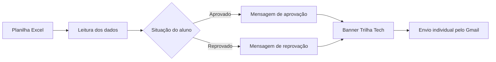

# StudentMailer

Automação de envio de e-mails personalizados para os alunos inscritos no curso **Trilha Tech**.

## Sobre o projeto

O StudentMailer foi desenvolvido para facilitar o envio de e-mails para um grande volume de pessoas, reduzindo tarefas manuais e mantendo uma comunicação padronizada.

A aplicação lê os dados dos alunos em uma planilha Excel, identifica a situação de cada inscrição e envia uma mensagem HTML personalizada de aprovação ou reprovação. As mensagens são encaminhadas individualmente por meio do Gmail e incluem o banner da Trilha Tech.

## Funcionalidades

- Leitura de alunos a partir de uma planilha Excel;
- criação de mensagens personalizadas para alunos aprovados e reprovados;
- inclusão automática do banner da Trilha Tech;
- envio individual por conexão segura com o Gmail;
- configuração de credenciais por variáveis de ambiente.

## Fluxo de funcionamento



1. O programa carrega `EMAIL_REMETENTE` e `SENHA_APP` do arquivo `.env`.
2. Abre uma conexão segura com o servidor SMTP do Gmail na porta `465`.
3. Lê os registros da aba `Resultado` do arquivo `Students/Students.xlsx`.
4. Identifica o nome, o e-mail e a situação de cada aluno.
5. Monta a mensagem correspondente e incorpora o banner da Trilha Tech.
6. Define remetente, destinatário e assunto.
7. Envia as mensagens uma por vez.

## Estrutura do projeto

```text
StudentMailer/
├── main.py
├── README.md
├── .env
├── Emails/
│   ├── email_Message.py
│   ├── imagem.jpeg
│   ├── message.py
│   └── sender.py
└── Students/
    └── planilha.py
```

### Principais módulos

| Arquivo                     | Responsabilidade                                                  |
| --------------------------- | ----------------------------------------------------------------- |
| `main.py`                 | Carrega as configurações, autentica no Gmail e realiza o envio. |
| `Students/planilha.py`    | Lê a planilha e fornece os dados dos alunos.                     |
| `Emails/sender.py`        | Cria cada mensagem e define seus cabeçalhos.                     |
| `Emails/email_Message.py` | Monta o objeto de e-mail conforme a situação do aluno.          |
| `Emails/message.py`       | Mantém os modelos HTML e incorpora o banner.                     |
| `Emails/imagem.jpeg`      | Imagem utilizada como banner nas mensagens.                       |

## Requisitos

- Python 3.10 ou superior;
- Git;
- uma conta Gmail autorizada para envio;
- uma senha de aplicativo do Google;
- arquivo `Students/Students.xlsx` preenchido.

As dependências Python utilizadas pelo projeto são `openpyxl` e `python-dotenv`.

## Como clonar o repositório

No terminal, execute:

```bash
git clone https://github.com/PedroAfonso10/StudentMailer.git
cd StudentMailer
```

## Instalação

Crie e ative um ambiente virtual:

### Windows PowerShell

```powershell
python -m venv venv
.\venv\Scripts\Activate.ps1
```

### Linux ou macOS

```bash
python3 -m venv venv
source venv/bin/activate
```

Em seguida, instale as dependências:

```bash
python -m pip install openpyxl python-dotenv
```

## Configuração

Crie um arquivo `.env` na raiz do projeto:

```env
EMAIL_REMETENTE=seu-email@exemplo.com
SENHA_APP=sua-senha-de-aplicativo
```

Use uma senha de aplicativo do Google, não a senha principal da conta. Nunca compartilhe ou versione credenciais, tokens ou o arquivo `.env`.

## Preparação da planilha

O arquivo utilizado pelo programa é `Students/Students.xlsx`. Ele deve conter uma aba chamada `Resultado`, com os dados começando na segunda linha:

| Coluna | Dado esperado                   |
| ------ | ------------------------------- |
| B      | Nome do aluno                   |
| C      | Endereço de e-mail             |
| H      | Situação no processo seletivo |

Na coluna H, utilize exatamente uma das opções abaixo, sem distinção entre letras maiúsculas e minúsculas:

- `aprovado`;
- `reprovado`.

Antes de iniciar um envio em massa, revise os nomes, endereços, situações e modelos de mensagem.

## Execução

Execute o comando a partir da raiz do projeto:

```bash
python main.py
```

O projeto utiliza caminhos relativos para localizar a planilha e a imagem. Por isso, executar o comando dentro da pasta `StudentMailer` é necessário para que esses arquivos sejam encontrados.

## Mensagens enviadas

O assunto configurado atualmente é:

```text
Resultado do processo seletivo - Trilha Tech
```

A mensagem de aprovação contém a data, o horário e o link do Google Classroom definidos em `Emails/message.py`. A mensagem de reprovação agradece a participação e informa a possibilidade de novas oportunidades.

## Observações

- Erros de autenticação, conexão, arquivo ausente, aba inexistente ou situação inválida são exibidos no terminal.
- O Gmail pode impor limites ou bloqueios para envios em grande volume. Faça um teste com poucos destinatários antes do envio completo e consulte as políticas da conta utilizada.
- O envio é sequencial e individual, sem colocar os demais destinatários no campo de cópia.
